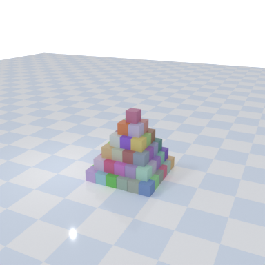
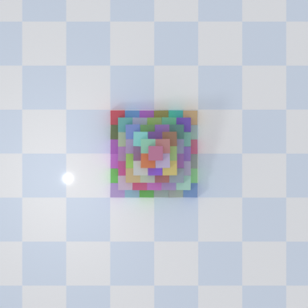
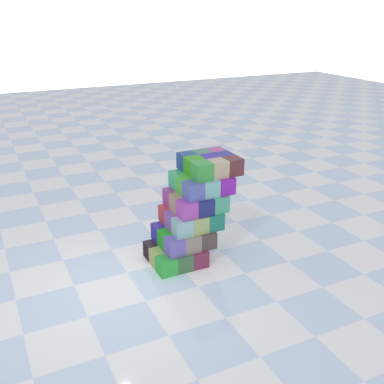
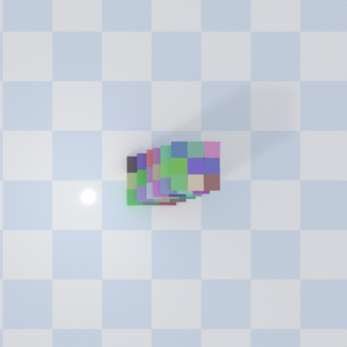
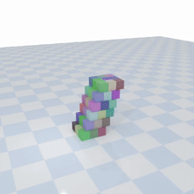

# Visual Structure Stability Prediction — Dacon Monthly AI Competition

> **[월간 데이콘] 구조물 안정성 물리 추론 AI 경진대회**
> 평가 지표: Log Loss (낮을수록 우수) · Public Best: **0.0291** · 선택 제출: **0.0375**

---

## Table of Contents

1. [Competition Background](#competition-background)
2. [Overview](#overview)
3. [Problem Definition](#problem-definition)
4. [Dataset](#dataset)
5. [Evaluation Metric](#evaluation-metric)
6. [Competition Rules](#competition-rules)
7. [Solution Architecture](#solution-architecture)
8. [Project Structure](#project-structure)
9. [Pipeline Flow](#pipeline-flow)
10. [Key Implementation Details](#key-implementation-details)
11. [Training Configuration](#training-configuration)
12. [How to Run](#how-to-run)
13. [Results](#results)
14. [GitHub & Data Sharing Policy](#github--data-sharing-policy)
15. [Dependencies](#dependencies)

---

## Competition Background

최근 인공지능 기술은 단순한 시각적 패턴 인식을 넘어, 이미지로부터 **물리적 상태와 동적 변화를 추론**하는 방향으로 빠르게 확장되고 있습니다. 특히 구조물의 안정성 판단과 붕괴 예측은 건설·로보틱스·시뮬레이션·재난 안전 분야에서 핵심 기술로 주목받고 있습니다.

구조물의 안정성은 외형적 기울기나 단순 형태 특징만으로는 충분히 설명하기 어렵습니다. **무게중심의 미세한 편차**, **층별 하중 분포**, **구조적 배치 패턴** 등 다양한 물리 요소가 종합적으로 작용하여 결과를 결정합니다.

본 대회는 다각도 구조물 이미지를 기반으로, 시각 정보를 통해 구조물의 물리적 안정성과 붕괴 가능성을 추론하는 AI 모델 개발을 목표로 하며, **구조적 형태와 물리적 관계를 함께 고려하는 정밀한 분석**이 요구됩니다.

---

## Overview

본 프로젝트는 **두 시점(정면 / 상단) 구조물 이미지**로부터 시뮬레이션 10초 이내의 붕괴 가능성(`unstable_prob`)과 안정 가능성(`stable_prob`)을 예측하는 AI 모델을 개발합니다.

핵심 도전 과제는 **도메인 갭(Domain Gap)** 입니다.

- **Train**: 광원·카메라가 고정된 실험실 환경 (1,000개)
- **Dev / Test**: 광원·카메라가 무작위로 변동하는 실제 평가 환경 (100 / 1,000개)

단순 이미지 분류를 넘어 **물리적 인과관계 추론** 능력이 요구되므로, DINOv2 시각 인코더에 물리 기반 기하학 특징 및 도메인 적응(GRL)을 결합한 멀티태스크 학습 방식으로 접근했습니다.

---

## Problem Definition

| 항목 | 내용 |
|---|---|
| **주제** | 시각 기반 구조물 안정성 예측 |
| **입력** | 구조물 정면(front) + 상단(top) 이미지 (2-view) |
| **출력** | `unstable_prob`, `stable_prob` (합산 = 1.0) |
| **레이블** | `stable`: 10초간 의미 있는 이동 없음 / `unstable`: 누적 이동 ≥ 1.5 cm 또는 붕괴 |
| **평가 지표** | Log Loss |
| **목표 범위** | 0.015 ≤ LogLoss ≤ 0.030 |

---

## Qualitative Examples

라벨 의미와 입력 형태를 한 번에 보여주기 위해, 대표 샘플 2개(`stable` / `unstable`)를 예시 이미지로 배치했습니다. 각 샘플은 `front.png`, `top.png`, 그리고 10초 시뮬레이션 GIF로 구성됩니다.

<table>
  <thead>
    <tr>
      <th>Label</th>
      <th>Front View</th>
      <th>Top View</th>
      <th>Simulation GIF</th>
    </tr>
  </thead>
  <tbody>
    <tr>
      <td><strong>Stable</strong></td>
      <td></td>
      <td></td>
      <td></td>
    </tr>
    <tr>
      <td><strong>Unstable</strong></td>
      <td></td>
      <td></td>
      <td></td>
    </tr>
  </tbody>
</table>

---

## Dataset

```
open/
├── train.csv                    # 학습 데이터 ID 및 라벨 (id, label)
├── dev.csv                      # 검증 데이터 ID 및 라벨 (id, label)
├── sample_submission.csv        # 제출 양식 (id, unstable_prob, stable_prob)
├── train/                       # 고정 실험실 환경 — 1,000개
│   └── {TRAIN_XXXX}/
│       ├── front.png            # 정면/측면 시점 이미지
│       ├── top.png              # 상단 시점 이미지
│       └── simulation.mp4       # 10초 분량 물리 시뮬레이션 영상 (학습 전용)
├── dev/                         # 무작위 광원·카메라 환경 — 100개 (test와 동일 설정)
│   └── {DEV_XXXX}/
│       ├── front.png
│       └── top.png
└── test/                        # 무작위 환경 — 1,000개 (모델 학습 불가)
    └── {TEST_XXXX}/
        ├── front.png
        └── top.png
```

### 컬럼 상세

| 파일 | 컬럼 | 설명 |
|---|---|---|
| `train.csv` / `dev.csv` | `id` | 샘플 고유 식별 번호 |
| | `label` | 구조물 상태: `unstable`(불안정) / `stable`(안정) |
| `sample_submission.csv` | `id` | 평가 데이터(Test) 고유 식별 번호 |
| | `unstable_prob` | 불안정 상태 예측 확률 (0 ~ 1) |
| | `stable_prob` | 안정 상태 예측 확률 (0 ~ 1) |

### 레이블 정의

| 레이블 | 조건 |
|---|---|
| `stable` | 시뮬레이션 시작 후 10초 동안 의미 있는 이동·변형 없음 |
| `unstable` | 10초 이내 누적 이동 거리 **≥ 1.5 cm** 또는 구조적 붕괴 발생 |

> **경계 샘플(Boundary)**: 일부 샘플은 외형만으로 안정 여부를 구분하기 어렵게 설계되어, 시각 정보 기반의 정밀한 물리 추론이 요구됩니다.

> `simulation.mp4` (train 전용): 프레임 간 픽셀 차이 분석으로 `max_diff`, `mean_diff`, 이동 발생 시점(onset), 심각도(severity) 등의 **보조 지도 신호(auxiliary supervision)**를 추출하는 데 사용됩니다.

---

## Evaluation Metric

### Log Loss (낮을수록 우수)

```python
import numpy as np

def LOGLOSS(true, pred, eps=1e-15):
    pred = np.clip(pred, eps, 1 - eps)
    pred = pred / np.sum(pred, axis=1).reshape(-1, 1)   # 행별 정규화
    loss = -np.sum(true * np.log(pred), axis=1)
    return np.mean(loss)
```

### 제출 파일 필수 조건

- 컬럼 순서: **`id` → `unstable_prob` → `stable_prob`** (순서 불일치 시 오류)
- 각 값: 0 이상 1 이하의 실수
- **행마다 `unstable_prob + stable_prob = 1.0`** (위반 시 자동 정규화되어 의도와 다른 점수 산출)

### Public / Private 분리

| 구분 | 비율 | 목적 |
|---|---|---|
| **Public Score** | 테스트 데이터의 **50%** | 대회 중 실시간 순위 확인 |
| **Private Score** | 테스트 데이터의 **100%** | 최종 순위 결정 기준 |

> Public Score에만 과적합된 전략은 Private Score에서 역전될 수 있습니다.

### 2단계 평가

1. **1차 평가**: 리더보드 Private Score 100% 반영
2. **2차 평가**: Private Score 상위 10팀 → 코드 + PPT 제출 → 코드 검증 후 수상자 결정

---

## Competition Rules

### 사전학습 모델

- 공식적으로 가중치가 공개된 모델 중 **상업적·비상업적 이용이 허용된 라이선스** (MIT, Apache 2.0, CC BY, CC BY-NC 등)만 사용 가능
- 사용·수정·재배포가 제한된 라이선스 모델은 사용 불가
- 원격 API 기반 모델(OpenAI API, Gemini API 등) 사용 불가 — **로컬 실행 필수**

> 본 프로젝트에서 사용한 `DINOv2 ViT-S/14 (dinov2_vits14_reg)`는 Apache 2.0 라이선스로 배포된 모델입니다. ✅

### 외부 데이터

- 대회 제공 학습(train)·개발(dev) 데이터 외 **외부 데이터 사용 허용**
- **단, 평가 데이터(test)는 어떠한 형태로도 모델 학습에 활용 불가**

> 본 프로젝트는 외부 데이터 없이 대회 제공 데이터만 사용하였습니다.

### 코드 제출 기준 (2차 평가 대상자)

- 데이터 입/출력 경로: **상대 경로** 사용
- 코드·주석 인코딩: **UTF-8**
- 모든 코드 오류 없이 실행 가능해야 함
- 개발 환경(OS) 및 라이브러리 버전 명시
- 제출 코드로 **Private Score 재현 가능**해야 함

---

## Solution Architecture

```
┌──────────────────────────────────────────────────────────────────┐
│                       DualViewPhysicsModel                       │
│                                                                  │
│  front.png ──► ViewEncoder ──►┐                                 │
│               (DINOv2 ViT-S)  ├──► TransformerFusion ──►        │
│  top.png ───► ViewEncoder ──►┘     (2-layer, 8-head)            │
│               (DINOv2 ViT-S)                                     │
│                                    image_feat  (1536-d)          │
│                                         │                        │
│  [Optional] GeometryFeatures (14-d) ──►┤                         │
│                                         ▼                        │
│                               ┌───────────────────┐             │
│                               │  classifier       │──► logit    │
│                               │  motion_reg       │──► motion   │
│                               │  onset_head       │──► onset    │
│                               │  severity_head    │──► severity │
│                               │  domain_head(GRL) │──► domain   │
│                               └───────────────────┘             │
│                                         │                        │
│                               TemperatureScaler (LBFGS)         │
└──────────────────────────────────────────────────────────────────┘
```

### ViewEncoder

| 구성 요소 | 내용 |
|---|---|
| **Backbone** | `DINOv2 ViT-S/14 with Registers` (`dinov2_vits14_reg`) |
| **특징 추출** | CLS 토큰(384-d) + Patch 토큰 평균(384-d) → concat → **768-d** |
| **Projection** | `Linear(768 → 512)` + GELU + Dropout(0.3) |
| **Pooling** | GeM (Generalized Mean Pooling, 학습 가능한 파라미터 `p`) |

### Transformer Fusion

- 두 ViewEncoder 출력에 학습 가능한 **View Embedding** 추가 후 Transformer 입력
- `TransformerEncoderLayer`: `d_model=512`, `nhead=8`, `ffn=2048`, `dropout=0.35`, Pre-LayerNorm
- `[front_feat ‖ top_feat ‖ fused_mean]` concat → **image_feat (1536-d)**

### Auxiliary Heads

| 헤드 | 출력 | 목적 |
|---|---|---|
| `classifier` | logit (1) | 메인 안정성 이진 분류 |
| `motion_reg` | 2-d | `max_diff` / `mean_diff` 회귀 |
| `onset_head` | 4-class | 이동 발생 시점 분류 |
| `severity_head` | 4-class | 이동 심각도 분류 |
| `domain_head` | 2-class via **GRL** | train↔dev 도메인 분류 (역전파로 도메인 불변 표현 학습) |

### Geometry Reasoning Module (`geometry_reasoning.py`)

전경 마스크 기반으로 물리적 구조 안정성과 직결되는 **14개 기하학 특징** 자동 추출:

| 뷰 | 특징명 |
|---|---|
| 상단 (top) | `top_area_frac`, `top_support_width_frac`, `top_support_height_frac`, `top_fill_ratio`, `top_centroid_dx`, `top_centroid_dy` |
| 정면 (front) | `front_height_frac`, `front_width_frac`, `front_slenderness`, `front_base_width_frac`, `front_top_width_frac`, `front_centroid_dx`, `front_tilt`, `front_top_heaviness` |

추출된 특징으로 `collapse_margin` 스코어를 계산해 보조 회귀 타깃으로도 활용합니다.

### Top-View Normalization (`checkerboard_rectification.py`)

- **문제**: Dev/Test 환경에서 카메라 각도가 무작위로 변동 → 상단 이미지 방향 불일치
- **해결**: 배경 선분 방향 추정 기반 회전 정규화
  - Scharr 엣지 → Canny → HoughLinesP → 주 방향각 추정 → 역회전 보정
  - 신뢰도 점수(conf) 계산 후 `conf < 0.20`이면 자동 스킵
- 결과를 `_angle_cache`에 캐시하여 동일 이미지 중복 연산 방지

---

## Project Structure

```
physics_solution/
│
├── .gitignore                     # 데이터·캐시·모델 가중치 Git 제외 설정
├── README.md                      # 본 문서
├── PIPELINE_ANALYSIS.md           # 파이프라인 상세 분석 문서
├── requirements-mac.txt           # Python 패키지 의존성 목록
│
├── full_physics_solution.py       # 핵심 파이프라인 (학습·추론·제출 생성)
│   ├── extract-motion             #   서브커맨드: 영상 → motion_targets.csv 추출
│   ├── train-design               #   서브커맨드: train→dev 단일 폴드 설계 검증
│   ├── cv-train                   #   서브커맨드: Pooled Grouped K-Fold 학습
│   ├── make-submission            #   서브커맨드: 저장된 모델로 제출 파일 생성
│   └── full-run                   #   서브커맨드: 위 전체 자동 실행 (권장)
│
├── checkerboard_rectification.py  # 상단뷰 회전 정규화 모듈
├── geometry_reasoning.py          # 물리 기반 기하학 특징 추출 모듈
│
├── run_colab_oneclick.py          # Google Colab 원클릭 실행기
├── run_colab_oneclick.sh          # run_colab_oneclick.py 의 bash 래퍼
├── make_colab_bundle.sh           # Colab 업로드용 프로젝트 zip 생성 스크립트
│
├── bootstrap_mac_env.sh           # Mac 로컬 환경 셋업 (.venv 생성 + 패키지 설치)
├── train.command                  # Mac 더블클릭 실행 — 학습 + 제출 파이프라인
├── full_pipeline.command          # Mac 더블클릭 실행 — 전체 파이프라인 (동일)
│
└── archive/                       # 역할 종료 파일 보존 (실행에 불필요)
    ├── patch_weight_decay.py      #   weight-decay 패치 유틸 (이미 통합됨)
    ├── infer.command              #   존재하지 않는 서브커맨드 호출
    ├── PhysicsSolution_Colab_OneClick.ipynb  # 구버전 노트북
    ├── README_COLAB.md            #   README.md에 통합됨
    └── checkerboard_eval_summary.md          # 개발 메모
```

---

## Pipeline Flow

```
[Step 1] extract-motion
  train/{id}/simulation.mp4
       │  프레임 간 픽셀 차이 분석 (64×64 리사이즈)
       ▼
  motion_targets.csv
  (max_diff_first · mean_diff_prev · severity_bucket · onset_bucket · soft_target)

[Step 2] build_geometry_clusters
  train + dev 이미지 중심 크롭 → 24×24 다운샘플 → StandardScaler → KMeans(k=32)
       ▼
  geometry_cluster (샘플별 클러스터 ID)

[Step 3] cv-train  ─  StratifiedGroupKFold(n_splits=5)
  pooled = train(1,000) + dev(100)
  stratify: label × source_domain
  group: geometry_cluster   ← 유사 구조물의 train/valid 분리 누수 방지
       ▼
  fold_1/ … fold_5/
      ├── best_model.pt       (val logloss 최솟값 체크포인트)
      ├── temperature.json    (Temperature Scaling 결과)
      └── oof_valid.csv       (OOF 예측값)

[Step 4] make-submission
  fold별 best_model.pt 로드
       │  TTA(tta_passes 회) 평균 → Temperature Scaling → fold 앙상블 평균
       ▼
  submission.csv  (id · unstable_prob · stable_prob)
```

---

## Key Implementation Details

### 손실 함수 (Multi-Task Learning)

```
Total Loss = BCE(main_classifier, soft_target)
           + 0.20 × SmoothL1(motion_reg)
           + 0.15 × CrossEntropy(onset_head)
           + 0.15 × CrossEntropy(severity_head)
           + 0.08 × SmoothL1(support_reg)     [--enable-geometry-reasoning 시]
           + 0.08 × SmoothL1(margin_reg)      [--enable-geometry-reasoning 시]
           + 0.05 × CrossEntropy(domain_head) [--use-domain-head 시]
```

- **Soft target**: 영상 모션 강도에 따라 hard label 0/1 을 연속값으로 보정
- **GRL lambda**: 에포크 진행에 따라 0 → 1 선형 증가 (도메인 헤드 점진 활성화)

### 옵티마이저 전략

| 파라미터 그룹 | LR |
|---|---|
| Backbone (`front/top_encoder.backbone`) | `backbone_lr` (1e-5) |
| 나머지 (헤드·퓨전·projection) | `lr` (2e-4) |

- **옵티마이저**: AdamW (`weight_decay=1e-4`)
- **스케줄러**: Linear Warmup (3 epoch) → Cosine Annealing

### 학습 안정화

| 기법 | 설정 |
|---|---|
| AMP (자동 혼합 정밀도) | `torch.amp.autocast` + `GradScaler` |
| Gradient Clipping | `max_norm = 1.0` |
| Seed 고정 | `random / numpy / torch / CUDA` (seed=42) |
| Best Checkpoint | Validation log loss 최소값 기준 저장 |
| Calibration | Temperature Scaling (LBFGS 200 iter) |

### Data Augmentation (Train only)

```python
CenterPhysicsCrop(view)                            # 구조물 중심 크롭
Resize(image_size, image_size)                     # 336×336
RandomApply(ColorJitter(b=0.35, c=0.35, ...), p=0.8)
RandomApply(GaussianBlur(k=5, σ=(0.1, 1.6)),  p=0.35)
RandomAdjustSharpness(0.8,                     p=0.2)
RandomPerspective(distortion=0.10,             p=0.35)
RandomAffine(degrees=7, translate=0.05, scale=(0.92, 1.08))
ToTensor()
RandomErasing(p=0.10, scale=(0.02, 0.08))
Normalize(mean=[0.485, 0.456, 0.406], std=[0.229, 0.224, 0.225])
```

---

## Training Configuration

| 파라미터 | 값 | 비고 |
|---|---|---|
| `--backbone` | `dinov2_vits14_reg` | DINOv2 ViT-S/14 with Registers |
| `--image-size` | `336` | DINOv2 14px 배수 (294 → 336) |
| `--batch-size` | `16` | Colab GPU 기준 |
| `--epochs` | `30` | 수렴 여유 확보 (25 → 30) |
| `--num-folds` | `5` | Geometry-clustered Grouped KFold |
| `--backbone-lr` | `1e-5` | Backbone 차별화 학습률 |
| `--weight-decay` | `1e-4` | AdamW 정규화 |
| `--warmup-epochs` | `3` | Linear warmup |
| `--tta-passes` | `4` | Test Time Augmentation 횟수 |
| `--use-domain-head` | ✅ | GRL 기반 도메인 적응 |
| `--enable-geometry-reasoning` | ✅ | 물리 기하 특징 14개 추가 |
| `--refresh-motion` | ✅ | motion_targets.csv 재추출 |

---

## How to Run

### 환경 설치

```bash
pip install torch torchvision tqdm numpy pandas scikit-learn \
            opencv-python-headless Pillow xformers
```

### A. Google Colab (권장)

**노트북 파일**: `0329_0.05_DINO_re (1).ipynb` *(별도 보관, 프로젝트 폴더 외)*

Drive에 아래 두 파일을 업로드한 뒤 셀을 순서대로 실행합니다.

```
/MyDrive/daCon/
├── physics_solution_0328.zip   # 본 프로젝트 코드 (make_colab_bundle.sh 로 생성)
└── open.zip                    # 데이콘 제공 데이터셋
```

| 셀 번호 | 역할 |
|---|---|
| 0 | `xformers` 설치 |
| 1 | Google Drive 마운트 |
| 2 | 경로 변수 설정 |
| 3 | zip 존재 확인 |
| 4 | 프로젝트 코드 압축 해제 및 로컬 배치 |
| 5 | 파일 목록 확인 |
| 6 | `--use-domain-head` 지원 여부 확인 (이미 네이티브 지원 — 자동 스킵) |
| 7 | 사전 점검 (핵심 키워드 grep) |
| **8** | **파이프라인 실행** ← 핵심 |
| 9 | `submission.csv` Drive 백업 |

### B. 로컬 / 서버 직접 실행

```bash
# Step 1: motion targets 추출 (최초 1회)
python full_physics_solution.py extract-motion \
    --data-root /path/to/open

# Step 2: 전체 파이프라인 실행 (학습 + 제출 파일 생성)
python full_physics_solution.py full-run \
    --data-root /path/to/open \
    --out-dir runs/final \
    --backbone dinov2_vits14_reg \
    --image-size 336 \
    --batch-size 16 \
    --epochs 30 \
    --num-folds 5 \
    --backbone-lr 1e-5 \
    --weight-decay 1e-4 \
    --tta-passes 4 \
    --use-domain-head \
    --enable-geometry-reasoning \
    --refresh-motion
```

### C. 원클릭 실행기 (Colab 자동화)

```bash
bash run_colab_oneclick.sh \
    --drive-zip-path "/content/drive/MyDrive/daCon/open.zip" \
    --local-root "/content/runtime" \
    --drive-output-root "/content/drive/MyDrive/daCon/outputs" \
    --image-size 336 \
    --batch-size 16 \
    --epochs 30 \
    --tta-passes 4 \
    --backbone-lr 1e-5 \
    --weight-decay 1e-4 \
    --use-domain-head \
    --enable-geometry-reasoning \
    --refresh-motion
```

### 출력 파일 구조

```
runs/final/
├── motion_targets.csv        # 영상 기반 보조 지도 신호
├── fold_1/
│   ├── best_model.pt         # 검증 logloss 최솟값 체크포인트
│   ├── temperature.json      # Temperature Scaling 온도 T
│   └── oof_valid.csv         # OOF 예측값 (pred_raw, pred_cal)
├── fold_2/ … fold_5/
├── cv_summary.csv            # 폴드별 성능 요약
├── oof_all.csv               # 전체 OOF 취합본
└── submission.csv            # 최종 제출 파일 (id · unstable_prob · stable_prob)
```

---

## Results

### 최종 순위

| 항목 | 값 |
|---|---|
| **최종 순위** | **70위** (전체 참가자 중) |
| **선택 제출 Public Score** | **0.0375** |
| **Best Public Score** | **0.0291** |

> 대회 종료 기준 (2026-03-31). 코드 검증 대상(Top 10)은 아니나, LogLoss 0.04대는 DINOv2 기반 멀티태스크 + 도메인 적응 전략의 유효성을 입증한 수치입니다.

### 제출 이력

| 제출 파일 | 제출 일시 | Public Score | Private Score | 비고 |
|---|---|---|---|---|
| submission (6).csv | 2026-03-31 00:59 | **0.0291** | 0.0466 | 최고 Public |
| submission_backup_20260329_204235.csv | 2026-03-30 05:43 | 0.0375 | - | **최종 선택 ★** |
| submission_0330_0330.csv | 2026-03-30 10:45 | 0.0378 | - | |
| submission_backup_20260330_175818.csv | 2026-03-31 11:44 | 0.0483 | 0.0553 | Public·Private 갭 최소 |

> ★ 최종 선택 제출: `submission_backup_20260329_204235.csv` (Public 0.0375)

### 모델 구성 요약

| 항목 | 값 |
|---|---|
| 백본 | DINOv2 ViT-S/14 with Registers (Apache 2.0) |
| 앙상블 | 5-fold Geometry-Grouped CV × TTA-4 |
| 캘리브레이션 | Temperature Scaling (LBFGS 200 iter) |
| 도메인 갭 대응 | Gradient Reversal Layer (GRL) |
| 물리 특징 | 기하학 14개 특징 (`geometry_reasoning.py`) |
| 보조 지도 신호 | 영상 기반 motion / onset / severity |

---

## GitHub & Data Sharing Policy

### 코드 공유

| 항목 | 허용 여부 | 비고 |
|---|---|---|
| 본 프로젝트 Python 코드 (`*.py`, `*.sh`, `*.ipynb`) | ✅ **공유 가능** | 대회 종료 후 GitHub 업로드 허용 |
| 사전학습 모델 가중치 (`dinov2_vits14_reg`) | ✅ **공유 가능** | Apache 2.0 라이선스 |
| 학습된 체크포인트 (`best_model.pt`) | ⚠️ 선택 사항 | 파일 크기 고려 (LFS 권장) |
| 데이콘 제공 데이터 (`train/`, `dev/`, `test/`, `*.csv`) | ❌ **공유 불가** | Dacon 이용약관 위반 |
| `simulation.mp4` 영상 원본 | ❌ **공유 불가** | 데이콘 제공 데이터 해당 |

### 데이터 공유 정책

데이콘 이용약관에 따라 **대회 제공 데이터는 어떠한 형태로도 공개 저장소에 업로드할 수 없습니다.**

- `open/` 디렉토리 전체 (이미지, CSV, 영상) — 공유 금지
- `motion_targets.csv` — 영상 분석으로 생성된 파일이나, 원본 데이터 파생물이므로 공유 금지

> 본 리포지토리의 `.gitignore`에 `data/`, `open/`, `*.mp4`, `open*.csv`, `motion_targets.csv`를 명시하여 데이터 파일이 실수로 커밋되지 않도록 설정하였습니다.

### 오픈소스 라이선스

| 구성 요소 | 라이선스 |
|---|---|
| 본 프로젝트 코드 | MIT (또는 개인 결정) |
| `DINOv2 ViT-S/14 (dinov2_vits14_reg)` | **Apache 2.0** — 상업적 이용 허용 |
| PyTorch / torchvision | BSD-style |
| scikit-learn | BSD-3-Clause |
| OpenCV | Apache 2.0 |

---

## Dependencies

| 패키지 | 버전(권장) | 용도 |
|---|---|---|
| `torch` | ≥ 2.0 | 모델 학습 및 추론 |
| `torchvision` | ≥ 0.15 | 이미지 변환 및 사전학습 모델 |
| `xformers` | 최신 | DINOv2 attention 가속 |
| `numpy` | ≥ 1.24 | 수치 연산 |
| `pandas` | ≥ 2.0 | 데이터 처리 |
| `scikit-learn` | ≥ 1.3 | KMeans · KFold · LogLoss · Calibration |
| `opencv-python-headless` | ≥ 4.8 | 영상 처리 · 기하학 특징 추출 |
| `Pillow` | ≥ 10.0 | 이미지 로딩 및 변환 |
| `tqdm` | ≥ 4.66 | 학습 진행 표시 |

### 개발 환경

| 항목 | 사양 |
|---|---|
| OS | Ubuntu 22.04 (Google Colab) |
| Python | 3.10+ |
| GPU | NVIDIA A100 (Colab) |
| CUDA | 11.8+ |

---

## License

본 코드는 Dacon 월간 데이콘 대회 참가 목적으로 작성되었습니다.
외부 데이터를 사용하지 않았으며, 대회 제공 데이터만 활용하였습니다.
데이콘 제공 데이터는 본 리포지토리에 포함되지 않습니다.
